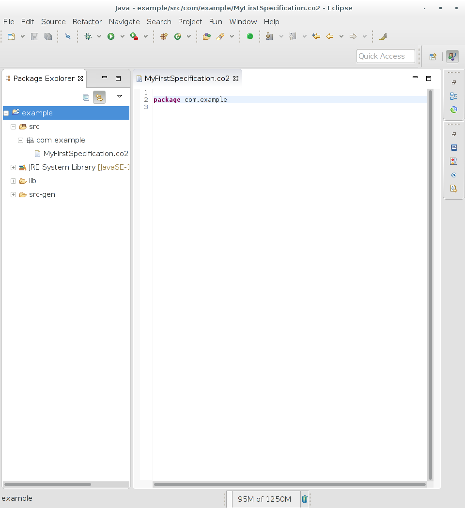

*************
First project
*************

The following steps assume that you have completed the :doc:`../installation` part.

Setup
=====

Open Eclipse and create a new Java project.

Make sure to configure the correct JRE, selecting ``JavaSE-1.8``.

Create a file ``src/com/example/MySpecification.co2``. Eclipse will prompt you to add 
the Xtext nature to the project: click ``yes``.

Once the file is created, the first thing to do is declare the ``package``:
it represent the file paths of the auto-generated Maude and Java files.

Saving ``src/com/example/MySpecification.co2``, the plugin creates the directory structure under ``src-gen``. Configure ``src-gen`` as a source directory.

In order to compile the Java source, 
we have to configure the :ref:`installation-java`
as a project dependency.

Click on ``Add External JARs...`` and select the jar archive from the filesystem.

Create and configure the property file ``src/local.properties``.
You can download and complete the following one: :download:`local.properties<_static/local.properties>`

The project is ready to write co2 specification!

-----------------------------------------------

Contract
=============

Define the following contract within ``MyFirstSpecification.co2``:

.. code-block:: co2

	contract C { 
		req? string . ( 
			ok!  
			(+) no! 
		) 
	}

A specification that advertises the contract ``C`` declares that it
will wait for a ``req`` uest (containing a message of type ``string``)
and then it answers ``ok`` or ``no``.

Receive actions are denoted by the question mark (``?``) and grouped with the
symbol ``+``; similarly, we use the bang (``!``) and the symbol ``(+)`` for send actions.
We specify the sort of a message (``int``, ``string`` or ``unit``) after the action label;
when the sort is omitted, we assume it is ``unit``.

Specification
=============

A co2 specification is:

.. code-block:: co2
	:linenos:

	specification P {
		tellAndWait x C .
		receive@x req?[msg:string] .
		if (msg=="valid message")
		then send@x ok!
		else send@x no!
	}

Line **1** define the specification ``P``.

At line **2** it advertise the contract ``C`` and waits until a new session
is established; when this happens, the variable ``x`` is bound
to the session name.

Then, it waits to receive a ``req``, binding the message
to the variable ``msg`` (lines **3**-**4**).

Finally, it sends ``ok`` if ``msg`` is equals to ``"valid message"``, 
``no`` otherwise.

Honesty
"""""""

In order to check the honesty of the specification ``P``,
we need to write:
	
.. code-block:: co2

	honesty P

right after the ``package`` declaration.
In fact, our file can contains multiple specification definitions,
so we need a way to state which ones must be honesty verified.

The file ``my-first-implementation.co2`` looks like:

:download:`my-first-implementation.co2 <_static/code/my-first-implementation.co2>`

.. literalinclude:: _static/code/my-first-implementation.co2
   :language: co2
   :linenos:

The honesty can be verified by right-click on ``src-gen/com/example/MyFirstSpecification.maude`` and
selecting ``Honesty (maude)``:

The output is shown within the **Console** view:

--------------------------------------

Implementation
==============

The plugin automatically generetes a Java skeleton within the package ``src-gen/com/example/MyFirstImplementation``, containing:

* ``Main.java``: this is the entry-point containing the contracts and the code to check our specifications;

* ``P.java``: contains the code of the specification ``P``.

.. code-block:: java
	:linenos:

	/*
	 * Main.java
	 */

	package com.example.MyFirstSpecification;

	import static it.unica.co2.api.contract.utils.ContractFactory.*;
	import it.unica.co2.api.contract.Contract;
	import it.unica.co2.api.contract.ContractDefinition;
	import it.unica.co2.api.contract.Recursion;
	import it.unica.co2.api.contract.Sort;
	import it.unica.co2.api.process.CO2Process;
	import it.unica.co2.api.process.Participant;
	import it.unica.co2.honesty.HonestyChecker;
	import co2api.ContractException;
	import co2api.ContractExpiredException;
	import co2api.Message;
	import co2api.Public;
	import co2api.Session;
	import co2api.SessionI;
	import co2api.TST;
	import co2api.TimeExpiredException;

	/*
	 * auto-generated by co2-plugin
	 * creation date: 11-04-2016 10:54:12
	 */
	@SuppressWarnings("unused")
	public class Main {
		
		private static String username = "test@co2-plugin.com";
		private static String password = "test";
		
		
		/*
		 * contracts declaration
		 */
		static ContractDefinition C = def("C");
		
		/*
		 * contracts initialization
		 */
		static {
			C.setContract(externalSum().add("req", Sort.string(), internalSum().add("ok", Sort.unit()).add("no", Sort.unit())));
		}
		
		
		public static void main(String[] args) {
			HonestyChecker.isHonest(P.class, Main.username, Main.password);
		}
	}

.. code-block:: java
	:linenos:

	/*
	 * P.java
	 */

	package com.example.MyFirstSpecification;

	import static it.unica.co2.api.contract.utils.ContractFactory.*;
	import it.unica.co2.api.contract.Contract;
	import it.unica.co2.api.contract.ContractDefinition;
	import it.unica.co2.api.contract.Recursion;
	import it.unica.co2.api.contract.Sort;
	import it.unica.co2.api.process.CO2Process;
	import it.unica.co2.api.process.Participant;
	import it.unica.co2.honesty.HonestyChecker;
	import co2api.ContractException;
	import co2api.ContractExpiredException;
	import co2api.Message;
	import co2api.Public;
	import co2api.Session;
	import co2api.SessionI;
	import co2api.TST;
	import co2api.TimeExpiredException;

	@SuppressWarnings("unused")
	public  class P extends Participant {
		
		private static final long serialVersionUID = 1L;
		
		public P(String username, String password) {
			super(username, password);
		}
		
		@Override
		public void run() {
			Session<TST> x = tellAndWait(Main.C);
			
			logger.info("waiting on 'x' for actions [req]");
			Message msg = x.waitForReceive("req");
			
			logger.info("received [req]");
			String msg1;
			msg1 = msg.getStringValue();
			if ((msg1.equals("valid message"))) {
				logger.info("sending action 'ok'");
				x.sendIfAllowed("ok");
			}
			else {
				logger.info("sending action 'no'");
				x.sendIfAllowed("no");
			}
		}
	}

Honesty
"""""""

The honesty of the class can be verified invoking

.. code-block:: java

	HonestyChecker.isHonest(P.class, Main.username, Main.password);

The output within the console looks like::

	================================================== HONESTY CHECKER 
	checking the honesty of com.example.MyFirstSpecification.P
	loading local properties
	starting JPF to build maude process
	--------------------------------------------------
	JPF ends without errors
	--------------------------------------------------
	generating the maude process from basic template
	loading local properties
	--------------------------------------------------
	model checking the maude process
	-------------------------------------------------- statistics
	Build of maude process:                  1352 msec
	Model-check of maude process:             175 msec
	Total time spent:                        1528 msec
	-------------------------------------------------- result
	honesty: HONEST
	==================================================

Refinement
""""""""""

To refine the ``P.java`` skeleton, it's recommended to copy 
the file to ``src`` folder, e.g. ``src/com/example/MyFirstSpecification/PRefined.java``.

All the files within ``src-gen`` are deleted and regenerated whenever
a co2 file within ``src`` changes.

Suppose we want to customize the validation of the received message.
Create a method:

.. code-block:: java

	private boolean messageIsValid(String msg) throws IllegalArgumentException {
		...
	}

and change the class as follows

.. code-block:: java
	:linenos:

	package com.example.MyFirstSpecification;

	//imports

	@SuppressWarnings("unused")
	public  class PRefined extends Participant {
		
		private static final long serialVersionUID = 1L;
		
		public PRefined(String username, String password) {
			super(username, password);
		}
		
		@Override
		public void run() {
			Session<TST> x = tellAndWait(Main.C);
			
			logger.info("waiting on 'x' for actions [req]");
			Message msg = x.waitForReceive("req");
			
			logger.info("received [req]");
			String msg1;
			msg1 = msg.getStringValue();
			if (messageIsValid(msg1)) {
				logger.info("sending action 'ok'");
				x.sendIfAllowed("ok");
			}
			else {
				logger.info("sending action 'no'");
				x.sendIfAllowed("no");
			}
		}
		
		private boolean messageIsValid(String msg) throws IllegalArgumentException {
			...
		}
	}

To verify the honesty of the program,
it is not important if the method returns true or false,
because it's invoked within the *if guard* and the tool
executes it symbolically.

However, what happens if the method throws a ``IllegalArgumentException``?
We need to instruct the tool to consider this eventuality.
So, we need to:

* declare all the exceptions that can be thrown by the method

* annotate it with ``@SkipMethod``

.. code-block:: java

	@SkipMethod
	boolean messageIsValid(String msg) throws IllegalArgumentException {
		...
	}

Now the tool also consider the case of an unexpected termination of the method, 
and it answers::

	================================================== HONESTY CHECKER 
	checking the honesty of com.example.MyFirstSpecification.PRefined
	loading local properties
	starting JPF to build maude process
	--------------------------------------------------
	JPF found an error
	error details: java.lang.IllegalArgumentException: This exception is thrown by the honesty checker. Please catch it!
		at com.example.MyFirstSpecification.PRefined.messageIsValid(PRefined.java:56)
		at com.example.MyFirstSpecification.PRefined.run(PRefined.java:43)
		at it.unica.co2.honesty.HonestyChecker.runProcess(HonestyChecker.java:182)

	impossible to build maude process
	--------------------------------------------------
	-------------------------------------------------- statistics
	Build of maude process:                  1295 msec
	Model-check of maude process:               0 msec
	Total time spent:                        1295 msec
	-------------------------------------------------- result
	honesty: UNKNOWN
	==================================================

Finally, if we catch the exception, the program come back **honest**.

The final version of ``src/com/example/MyFirstSpecification/PRefined.java`` is:

.. code-block:: java	

	package com.example.MyFirstSpecification;

	import static it.unica.co2.api.contract.utils.ContractFactory.*;

	import com.example.MyFirstSpecification.Main;

	import it.unica.co2.api.contract.Contract;
	import it.unica.co2.api.contract.ContractDefinition;
	import it.unica.co2.api.contract.Recursion;
	import it.unica.co2.api.contract.Sort;
	import it.unica.co2.api.process.CO2Process;
	import it.unica.co2.api.process.Participant;
	import it.unica.co2.api.process.SkipMethod;
	import it.unica.co2.honesty.HonestyChecker;
	import co2api.ContractException;
	import co2api.ContractExpiredException;
	import co2api.Message;
	import co2api.Public;
	import co2api.Session;
	import co2api.SessionI;
	import co2api.TST;
	import co2api.TimeExpiredException;

	@SuppressWarnings("unused")
	public  class PRefined extends Participant {
		
		private static final long serialVersionUID = 1L;
		
		public PRefined(String username, String password) {
			super(username, password);
		}
		
		@Override
		public void run() {
			Session<TST> x = tellAndWait(Main.C);
			
			logger.info("waiting on 'x' for actions [req]");
			Message msg = x.waitForReceive("req");
			
			logger.info("received [req]");
			String msg1;
			msg1 = msg.getStringValue();
			
			try {
				if (messageIsValid(msg1)) {
					logger.info("sending action 'ok'");
					x.sendIfAllowed("ok");
				}
				else {
					logger.info("sending action 'no'");
					x.sendIfAllowed("no");
				}
			}
			catch (IllegalArgumentException e) {
				logger.info("sending action 'no'");
				x.sendIfAllowed("no");
			}
		}
		
		@SkipMethod
		private boolean messageIsValid(String msg) throws IllegalArgumentException {
			// some code
			return false;
		}
	}

