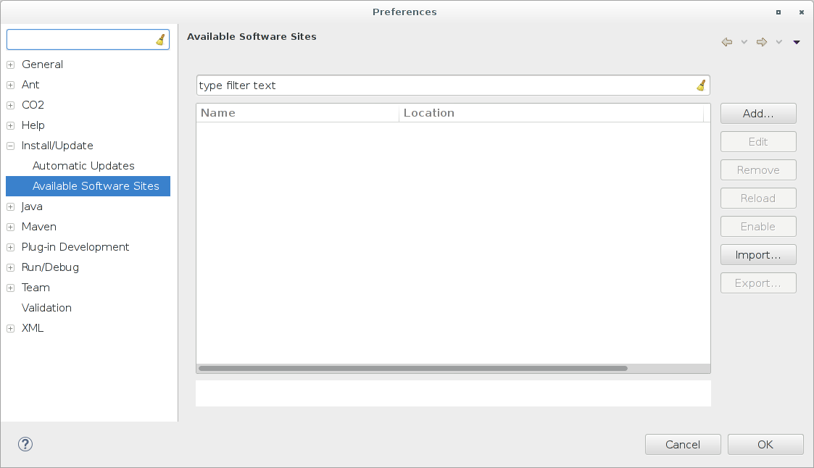
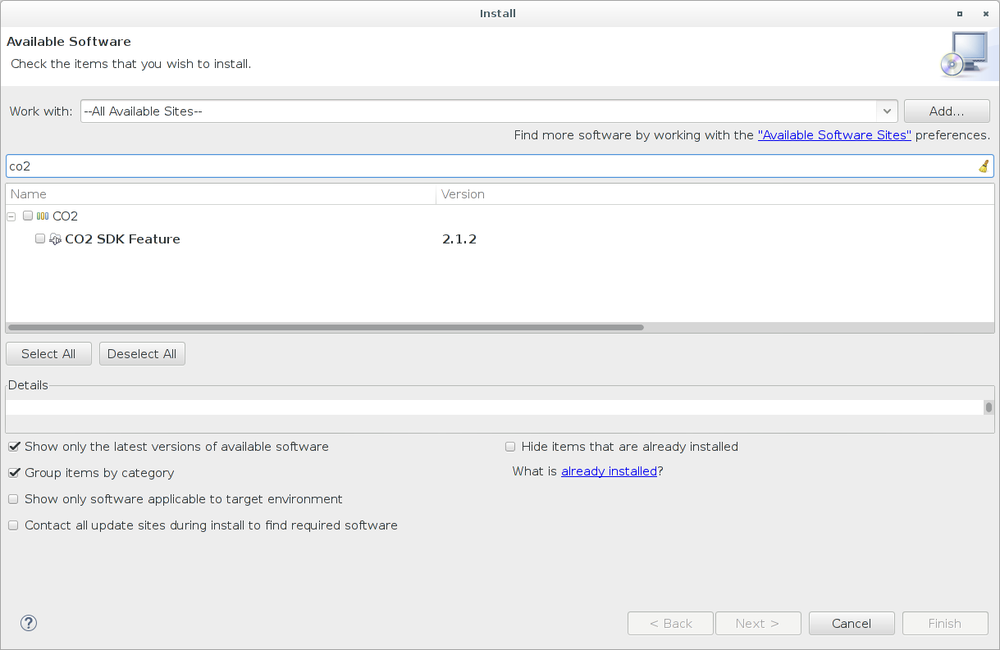
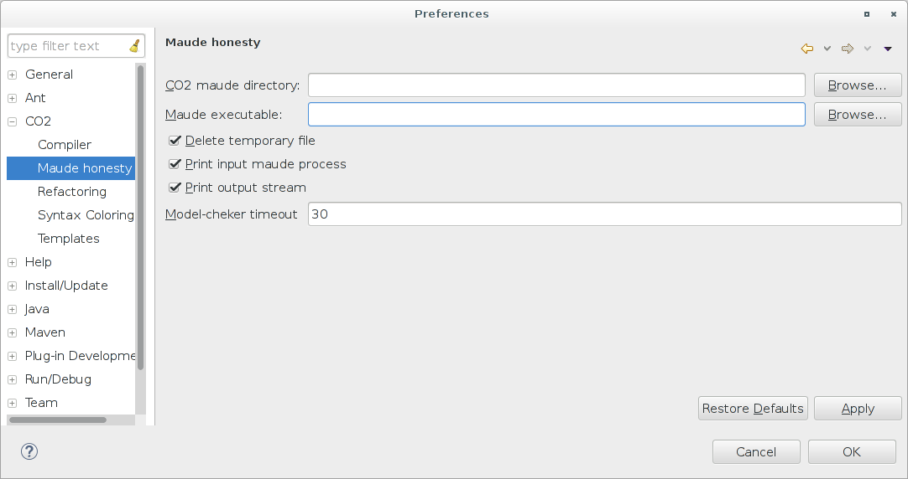

************
Installation
************

CO2 model checker
=================

Requirements
------------

Install the maude system

* following the official guide at `Maude download and installation <http://maude.cs.illinois.edu/w/index.php?title=Maude_download_and_installation>`_:

* on Linux distribution, searching for a *maude* package

Installation
------------

Download the co2 model-checker: `http://co2.unica.it/co2-maude_2016-05-02.zip <http://co2.unica.it/co2-maude_2016-05-02.zip>`_.

Extract the archive:

.. code-block:: bash
	
	cd ~
	tar xzf co2-abstract-maude.tar.gz

Check the installation:

.. code-block:: bash

	cd co2-abstract-maude
	maude -no-advise -no-banner blackjack.maude
	
.. code-block:: none

	==========================================
	reduce in BLACKJACK : honest(P, ['BLACKJACK], 5) .
	rewrites: 126060 in 230ms cpu (229ms real) (548086 rewrites/second)
	result Bool: true
	Bye.

------------------------------------------------------------------

Eclipse plugin
==============

Requirements
------------

* **Java 1.8**

Installation
------------

Open the eclipse preferences page on ``Window > Preferences``.

Go to the page ``Install/Update > Available Software Sites``.

Add the following update sites by clicking on the ``Add...`` button:

* `Xsemantics 1.8.x <http://sourceforge.net/projects/xsemantics/files/updates/releases/1.8>`_

* `Xtext 2.8.x <http://download.eclipse.org/modeling/tmf/xtext/updates/composite/releases/>`_  (only for Eclipse IDE older than the *mars* version 4.5.x )

* `CO2 <http://co2.unica.it/downloads/co2-eclipse-plugin/>`_

Go to ``Help > Install new software...``.

Select ``--All Available Sites--``.

Select and install the ``CO2 SDK Feature``.

Configuration
-------------

Open the eclipse preferences page on ``Window > Preferences``.

Go to the page ``CO2 > Maude honesty``.

Set the field:

* ``CO2 maude directory``: the absolute path of the directory containing the maude model checker (e.g. ``/home/<yourname>/co2-abstract-maude``)
* ``Maude executable``: the executable maude file (e.g. ``/bin/maude``)

Optional properties:

* ``Delete temporary file``: in order to check honesty, a temp file is created into ``CO2 maude directory``

* ``Print input maude process``: print the input file

* ``Print output stream``: print the model checker output

* ``Model-checker timeout``: seconds to wait before kill the maude process

------------------------------------------------------------------

.. _installation-java:

Java verification tool
======================

Requirements
------------

* **Java 1.8**

**UPDATE** (10-05-2016)
	please install version **8u77** or lower. Unfortunately a dependency does not work properly with the newest Java versions 8u91 and 8u92. We are trying to resolve the problem. (**resolved** with version 5.1.12)

Installation
------------

Download the **latest** version from `http://co2.unica.it/co2-honesty-checker/ <http://co2.unica.it/co2-honesty-checker/>`_.

Configure the java classpath in order to include this jar.

Configuration
-------------

You have to create a file ``local.properties`` and include it within the classpath. It must containe the following properties:

* ``honesty.maude.co2-maude``: the absolute path of the directory containing the maude model checker (e.g. ``/home/<yourname>/co2-abstract-maude``)

* ``honesty.maude.exec``: the executable maude file (e.g. ``/bin/maude``)

Optional properties are:

* ``honesty.maude.verbose = true | false``: print additional input/output information during the co2 model verification

* ``honesty.maude.timeout``: seconds to wait before kill the maude process (avoid infinite wait)

Example of the property file: :download:`local.properties<_static/local.properties>`

------------------------------------------------------------------

See the project example at :doc:`../first-project` for a step-by-step example.
